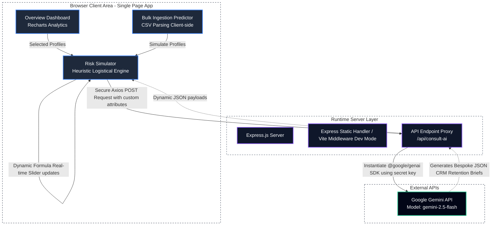

# 📊 Customer Churn Analytics & Prediction Console

An interactive, enterprise-grade AI-powered system designed for prognostic customer churn intelligence. Built on the classic **IBM Telco Churn dataset**, this application pairs a high-performance client-side logistic heuristic predictor with deep server-side AI forensic intelligence powered by Google's Gemini Models.

---

## 🌟 Key Functional Views

### 1. Overview Dashboard
* **Dynamic Metric Strips**: High-fidelity cards outlining critical health parameters including cohort database size (`7,043` historically compiled clients), global churn benchmarks (`26.54%`), standard subscription price points, and median account tenures (`32.4 months`).
* **Visual Analytics**: Interactive, responsive charts powered by Recharts comparing Churn Rate vs. Contract Type and Cohort Attrition sizes over discrete billing cycles.
* **Interactive Customer Ledger**: A searchable database view mapped directly to standard user characteristics. Supports instant loading of any representative client profile directly into the Simulator.

### 2. Individual Risk Simulator
* **Real-time Slide & Toggle Parameter Ingestion**: Adjust customer demographics (Gender, Senior Citizen status), account tenure, monthlycharges, contract duration types (Month-to-month, One year, Two year), payment modes, internet tier types, and tech support add-ons.
* **Instant Speedometer Risk Assessment**: High-fidelity dynamic speedometer tracking churn probability (Low, Medium, High risk thresholds) driven by multi-variable logistic drivers.
* **Leading Statistical Triggers**: Granular breakdown of individual parameters indicating positive or negative weight impacts relative to statistical benchmarks.
* **Gemini Forensic Intelligence**: Invoke an automated deep-forensic CRM query compiling bespoke behavioral synthesis briefs and prioritized, deployable retention interventions directly within the dashboard.

### 3. Bulk Ingestion Predictor
* **CSV Bulk Loader**: Batch ingest custom client lists parsed directly on the client-side using `papaparse`.
* **Dry-Run Mode**: Instantly load a benchmark array of 25 model profiles detailing varying tenure conditions.
* **Threat Category Metrics**: Real-time batch-wide counters showing Batched Total, High Risk Counts, Medium Threat Groups, and average batch churn probabilities.
* **Results Ledger**: Granular, pageable results mapping individual calculated risks with inline links to feed specifically chosen records back into the Simulator for isolation testing.

---

## 🛠️ Technical Stack & Architecture

This application employs a full-stack, server-proxied architecture ensuring client-safe secret management and responsive interaction cycles:

### System Interaction Diagram



### Flow & Data Pathway Blueprint

```text
┌────────────────────────────────────────────────────────────────────────┐
│                      CLIENT SIDE (React Spa Bundle)                     │
│                                                                        │
│  ┌────────────────────┐   Profile Selected    ┌─────────────────────┐  │
│  │ Overview Dashboard │ ────────────────────> │   Risk Simulator    │  │
│  └────────────────────┘                       └──────────┬──────────┘  │
│                                                          │             │
│  ┌────────────────────┐   Load Batch Profile             │             │
│  │   Bulk Ingestion   │ ─────────────────────────────────┘             │
│  └────────────────────┘                                                │
└───────────────────────────────────────────────────┬────────────────────┘
                                                    │ Secures Session Details
                                                    │ (POST /api/consult-ai)
                                                    ▼
┌────────────────────────────────────────────────────────────────────────┐
│                     SERVER SIDE (Express Sandbox)                       │
│                                                                        │
│        ┌──────────────────────────────────────────────────────┐        │
│        │                 Express API Proxy                    │        │
│        │   - Receives target client customer parameters      │        │
│        │   - Standardized JSON sanitization & safety wrappers │        │
│        └──────────────────────────┬───────────────────────────┘        │
└───────────────────────────────────┼────────────────────────────────────┘
                                    │ Backend SDK Handshake 
                                    │ (Loads secret GEMINI_API_KEY)
                                    ▼
┌────────────────────────────────────────────────────────────────────────┐
│                        EXTERNAL COGNITIVE ENGINE                       │
│                                                                        │
│               ┌────────────────────────────────────────┐               │
│               │           Google Gemini Models         │               │
│               │    - Performs Deep Forensic Audit       │               │
│               │    - Generates targeted retention schemes │               │
│               └────────────────────────────────────────┘               │
└────────────────────────────────────────────────────────────────────────┘
```

* **Front-end**: React 19, TypeScript, Tailwind CSS, Lucide React (UI Icons), Recharts (Analytical Graphs), Motion (Micro-animations / Staggers), and PapaParse (CSV processing).
* **Back-end Server**: Express.js server running in dynamic ESM / CommonJS compiled modes. Coordinates runtime API proxies for Gemini queries.
* **LLM Engine**: Google `@google/genai` TypeScript SDK utilizing the server-proxied `GEMINI_API_KEY` credential to ensure complete API key security (preventing browser-wide exposures).

---

## ⚙️ Configuration & Setup

### Prerequisites
* **Node.js**: `v20` or higher
* **npm**: `v10` or higher

### 1. Environment Configuration
Create or modify your `.env` file in the project's root directory:

```env
# Server secret (Required for Gemini forensic briefs)
GEMINI_API_KEY=your_gemini_api_key_here
```

### 2. Dependency Installation
Install all runtime and developer dependencies:
```bash
npm install
```

### 3. Running the Application

* **Development Mode**: Boots the integrated Express-Vite middleware dev site.
  ```bash
  npm run dev
  ```
* **Production Compilation**: Bundles the front-end SPA and bundles the backend TypeScript server into a streamlined standalone production script (`dist/server.cjs`) with `esbuild`.
  ```bash
  npm run build
  ```
* **Standalone Server Execution**: Launches the pre-compiled server natively.
  ```bash
  npm run start
  ```
* **Linter Code Checks**:
  ```bash
  npm run lint
  ```

---

## 🔒 Security Practices

1. **API Key Isolation**: The `GEMINI_API_KEY` is retrieved and loaded purely on the server side using Express environments. No downstream API keys are exposed to the client-side bundles or browser DevTools.
2. **Lazy Initialization**: Server SDK components are loaded defensively, failing gracefully if credentials are not configured rather than crashing the primary node server.
